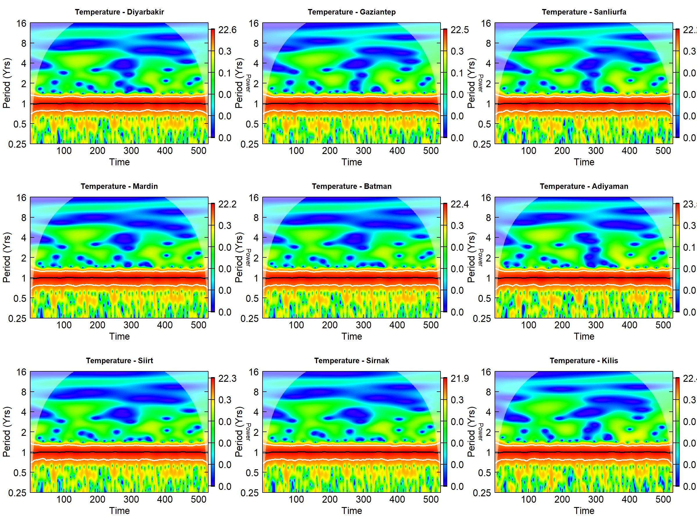
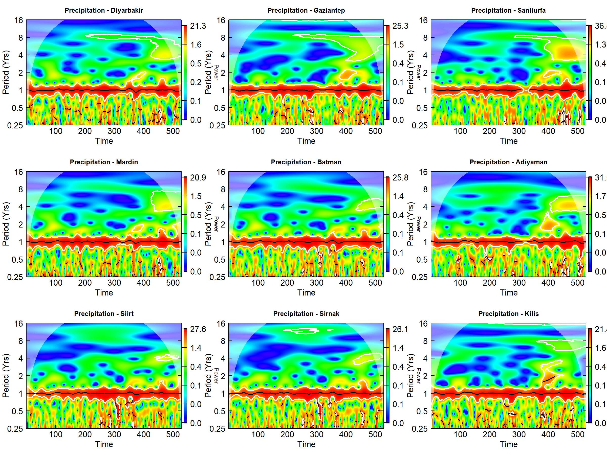

# NASA POWER-Based Wavelet Analysis of Climate Variability in Southeastern Türkiye

<p align="center">
  
  
</p>

<p align="center">
  <strong>Time–frequency analysis of temperature and precipitation variability using NASA POWER data</strong>
</p>

---

## Overview

This project investigates the temporal variability and time–frequency characteristics of climate variables across Southeastern Türkiye using long-term NASA POWER meteorological data.

Unlike conventional trend-based climate analyses, this study applies wavelet-based methods to identify dominant periodicities, temporal changes in climate variability, and time-dependent relationships between meteorological variables.

The main objective is to determine not only whether climate variables have changed over time, but also:

> **When do these changes occur, and at which temporal scales are they strongest?**

---

## Key Visual Results

### Temperature Wavelet Analysis

<p align="center">
  
</p>

### Precipitation Wavelet Analysis

<p align="center">
  
</p>

---

## Study Region

The study focuses on Southeastern Türkiye, a region characterized by strong seasonal variability, semi-arid climatic conditions, high summer temperatures, and substantial interannual precipitation variability.

---

## Data Source

All meteorological data are obtained from:

**NASA Prediction of Worldwide Energy Resources (NASA POWER)**

### Study Period

**1981–2025**

### Temporal Resolution

Daily observations aggregated into monthly climate time series.

---

## Climate Variables

| Variable | Description |
|---|---|
| T2M | Mean air temperature at 2 m |
| T2M_MAX | Maximum air temperature at 2 m |
| T2M_MIN | Minimum air temperature at 2 m |
| PRECTOTCORR | Corrected precipitation |
| RH2M | Relative humidity at 2 m |

---

# Methodology

## Continuous Wavelet Transform

The Continuous Wavelet Transform (CWT) is used to investigate climate variability simultaneously in the time and frequency domains.

The analysis identifies:

- Dominant periodicities
- Temporal changes in variability
- Significant oscillations
- Cone of Influence (COI)
- Wavelet power

## Cross-Wavelet Transform

Cross-Wavelet Transform will be used to identify common high-power oscillations between climate variables.

## Wavelet Coherence

Wavelet Coherence will be used to investigate time-dependent relationships between:

- Temperature and precipitation
- Temperature and relative humidity
- Precipitation and relative humidity

---

# Research Questions

1. What are the dominant periodicities in temperature and precipitation?
2. Have these periodicities changed through time?
3. Which periods contain statistically significant oscillations?
4. At which temporal scales are temperature and precipitation most strongly related?
5. Does climate coupling vary between seasonal and multi-annual scales?

---

# Analytical Workflow

```text
NASA POWER API
       │
       ▼
Daily Climate Data
       │
       ▼
Quality Control
       │
       ▼
Monthly Climate Series
       │
       ▼
Descriptive Analysis
       │
       ▼
Trend Analysis
       │
       ▼
Continuous Wavelet Transform
       │
       ├──────────────► Wavelet Power Spectrum
       │
       ├──────────────► Cross-Wavelet Transform
       │
       └──────────────► Wavelet Coherence
       │
       ▼
Time–Frequency Climate Interpretation

## Overview

This project investigates the temporal variability and time–frequency characteristics of climate variables across Southeastern Türkiye using long-term NASA POWER meteorological data.

Unlike conventional trend-based climate analyses, this study applies wavelet-based methods to identify dominant periodicities, temporal changes in climate variability, and time-dependent relationships between meteorological variables.

The main objective is to determine not only whether climate variables have changed over time, but also:

> **When do these changes occur, and at which temporal scales are they strongest?**

---

## Study Region

The study focuses on Southeastern Türkiye, a climatically diverse region characterized by:

- Strong seasonal temperature variability
- Pronounced precipitation seasonality
- Semi-arid and dry sub-humid conditions
- High summer temperatures
- Increasing exposure to drought and heat extremes

The region provides an appropriate geographical setting for investigating multi-scale climate variability.

---

## Data Source

All meteorological data are obtained from:

**NASA Prediction of Worldwide Energy Resources (NASA POWER)**

### Study Period

**1981–2025**

### Temporal Resolution

Daily observations aggregated into monthly climate time series.

---

## Climate Variables

| Variable | Description |
|---|---|
| T2M | Mean air temperature at 2 m |
| T2M_MAX | Maximum air temperature at 2 m |
| T2M_MIN | Minimum air temperature at 2 m |
| PRECTOTCORR | Corrected precipitation |
| RH2M | Relative humidity at 2 m |

---

# Research Objectives

The study aims to:

1. Examine long-term climate variability.
2. Identify dominant periodicities in climate time series.
3. Detect temporal changes in climate variability.
4. Investigate temperature–precipitation relationships.
5. Examine temperature–humidity interactions.
6. Identify statistically significant oscillations.
7. Determine whether climate relationships vary across temporal scales.

---

# Methodology

## 1. Data Acquisition

Daily climate data are obtained from the NASA POWER API.

The workflow is designed to be reproducible, allowing the dataset to be regenerated directly from the API.

---

## 2. Data Processing

The raw data are:

- Imported into R
- Quality controlled
- Checked for missing values
- Converted into standardized time series
- Aggregated from daily to monthly observations
- Prepared for time–frequency analysis

---

## 3. Descriptive Analysis

The initial analysis includes:

- Monthly climatology
- Annual variability
- Climate anomalies
- Seasonal variability
- Interannual variability

---

## 4. Trend Analysis

Conventional statistical methods are applied before the wavelet analysis.

### Statistical Methods

- Mann–Kendall trend test
- Sen's slope estimator
- Climate anomaly analysis

These methods provide information about the overall direction and magnitude of climate change.

---

# 5. Continuous Wavelet Transform

The **Continuous Wavelet Transform (CWT)** is the core method of this project.

CWT decomposes climate time series into:

- Time
- Frequency
- Period

This allows dominant oscillations to be identified and their temporal evolution to be investigated.

### Main outputs

- Wavelet Power Spectrum
- Dominant periodicities
- Cone of Influence (COI)
- Statistical significance
- Time-dependent variability

---

## Temperature Wavelet Analysis

<p align="center">
  
</p>

---

## Precipitation Wavelet Analysis

<p align="center">
  
</p>

---

# 6. Cross-Wavelet Transform

The **Cross-Wavelet Transform (XWT)** is used to identify common high-power oscillations between climate variables.

The main relationships investigated are:

- Temperature ↔ Precipitation
- Temperature ↔ Relative Humidity
- Precipitation ↔ Relative Humidity

---

## Temperature–Precipitation Cross-Wavelet Analysis

<p align="center">
  
</p>

---

# 7. Wavelet Coherence

**Wavelet Coherence (WTC)** is used to investigate localized relationships between climate variables in the time–frequency domain.

Unlike conventional correlation analysis, wavelet coherence allows relationships to vary across both time and frequency.

The analysis evaluates:

- Coherent periods
- Phase relationships
- Temporal changes in coupling
- Annual variability
- Multi-annual variability

---

## Temperature–Precipitation Wavelet Coherence

<p align="center">
  
</p>

---

## Temperature–Humidity Wavelet Coherence

<p align="center">
  
</p>

---

## Precipitation–Humidity Wavelet Coherence

<p align="center">
  
</p>

---

# Research Questions

### RQ1
What are the dominant temporal periodicities in temperature, precipitation, and atmospheric moisture?

### RQ2
Have dominant periodicities remained stable throughout the study period?

### RQ3
During which periods do statistically significant climate oscillations occur?

### RQ4
At which temporal scales do temperature and precipitation exhibit significant coherence?

### RQ5
Does the relationship between temperature and atmospheric moisture vary through time?

### RQ6
Are climate relationships stronger at seasonal, annual, or multi-annual scales?

---

# Analytical Workflow

```text
NASA POWER API
       │
       ▼
Daily Climate Data
       │
       ▼
Quality Control
       │
       ▼
Monthly Climate Series
       │
       ├──────────────► Descriptive Analysis
       │
       ├──────────────► Mann–Kendall
       │
       ├──────────────► Sen's Slope
       │
       ▼
Continuous Wavelet Transform
       │
       ├──────────────► Wavelet Power Spectrum
       │
       ├──────────────► Cross-Wavelet Transform
       │
       └──────────────► Wavelet Coherence
       │
       ▼
Time–Frequency Climate Interpretation
